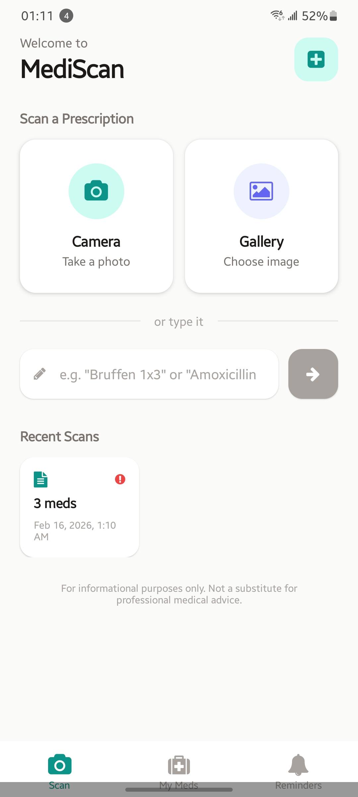
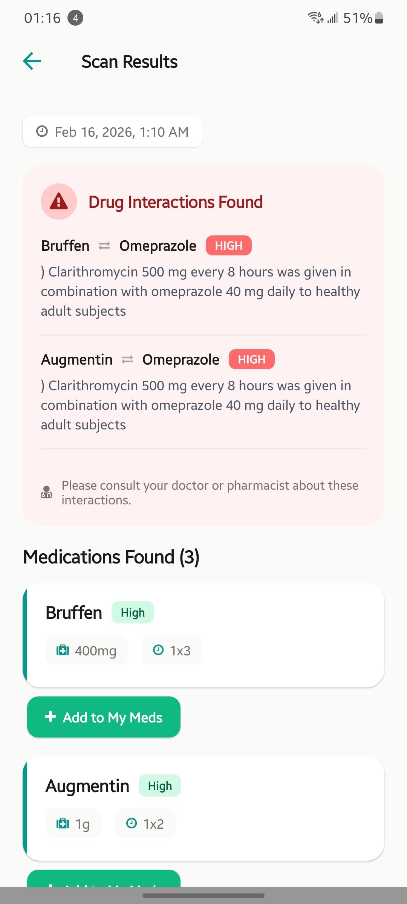
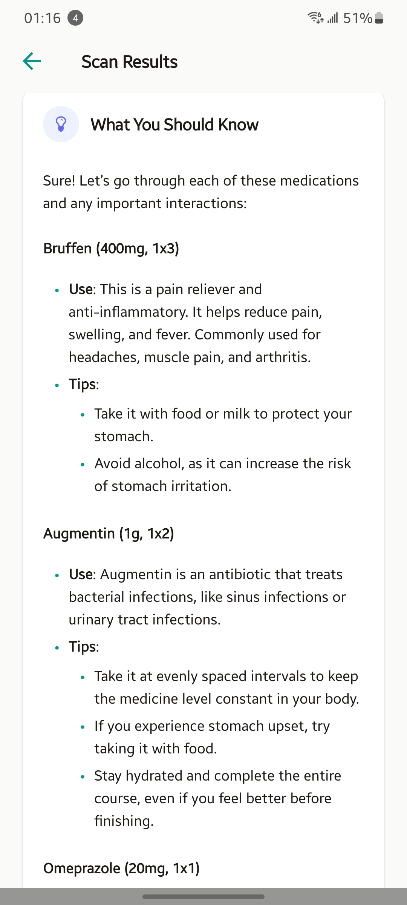
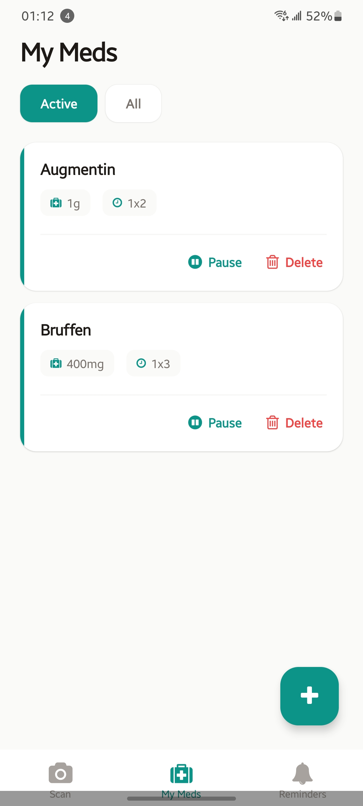
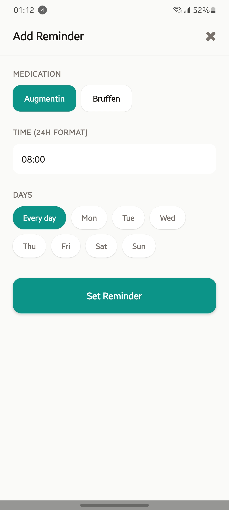

# DrugScan

AI-powered prescription scanner — snap a photo or type a shorthand like `Bruffen 1x3`, and get extracted medication details, drug interaction checks, and plain-language explanations.

## Try It Now

**[Download the APK](https://expo.dev/accounts/ianoviewcy/projects/mediscan/builds/cf04c1d4-b220-4107-92e9-b3f3c2dab0af)** — open this link on your Android phone, install the app, and start scanning. No setup required.

> Android only for now. iOS support is coming.

---

## Screenshots

<p align="center">
  
  
  
</p>
<p align="center">
  
  
</p>

---

## How It Works

1. **Scan or type** a prescription — camera, gallery, or text input like `Augmentin 1g 1x2`
2. **GPT-4o** extracts medication names, dosages, and frequencies
3. **OpenFDA** checks for drug interactions against your existing medications
4. **GPT-4o** generates a plain-language explanation with tips
5. **Save** medications to your list and set reminders

---

## Tech Stack

| Layer | Technology |
|-------|-----------|
| Framework | React Native 0.81 + Expo SDK 54 |
| Routing | Expo Router 6 (file-based) |
| Backend | Convex (serverless functions + real-time database) |
| AI | OpenAI GPT-4o (vision + text completions) |
| Drug Data | OpenFDA API (public, no key needed) |
| Language | TypeScript 5.9 (strict) |

---

## Development Setup

### Prerequisites

- Node.js >= 18

### Setup

```bash
# 1. Clone and install
git clone <repo-url> && cd mediscan
npm install

# 2. Create your local env file (get the values from the team)
cp .env.example .env.local

# 3. Start the app
npx expo start
```

Scan the QR code with Expo Go on your phone, or press `a` for Android emulator.

> **Note:** The Convex backend and API keys are already configured on the shared deployment. You just need the `EXPO_PUBLIC_CONVEX_URL` value in your `.env.local` — ask a team member.

### Environment Variables

| Variable | Where | Purpose |
|----------|-------|---------|
| `EXPO_PUBLIC_CONVEX_URL` | `.env.local` | Connects the app to the shared Convex deployment |
| `OPENAI_API_KEY` | Convex env (already set) | Used server-side by Convex actions — no local setup needed |

> The OpenFDA API is public and requires no key.

### Building a New APK

```bash
# Deploy latest Convex functions to production
npx convex deploy --yes

# Build preview APK on EAS cloud
eas build --profile preview --platform android
```

The build takes ~10 minutes. EAS returns a download link you can share with the team.

---

## Project Structure

```
mediscan/
├── app/                              # Screens (file-based routing)
│   ├── _layout.tsx                   # Root layout, Convex + User providers
│   ├── (tabs)/
│   │   ├── _layout.tsx               # Tab bar (Scan, My Meds, Reminders)
│   │   ├── index.tsx                 # Scan screen
│   │   ├── medications.tsx           # Medication list + add form
│   │   └── reminders.tsx             # Reminder list + add form
│   └── results/
│       └── [id].tsx                  # Scan results detail
│
├── components/
│   ├── CameraCapture.tsx             # Image picker (camera + gallery)
│   ├── MedicationCard.tsx            # Medication display card
│   ├── InteractionWarning.tsx        # Drug interaction banner
│   ├── ReminderItem.tsx              # Reminder row with toggle
│   ├── LoadingSpinner.tsx            # Activity indicator
│   └── EmptyState.tsx                # Empty list placeholder
│
├── contexts/
│   └── UserContext.tsx               # Anonymous user identity (AsyncStorage)
│
├── convex/                           # Backend (deployed to Convex cloud)
│   ├── schema.ts                     # Database schema
│   ├── ai.ts                         # OpenAI actions
│   ├── drugApi.ts                    # OpenFDA interaction check
│   ├── scans.ts                      # Scan CRUD
│   ├── medications.ts                # Medication CRUD
│   ├── reminders.ts                  # Reminder CRUD
│   ├── users.ts                      # User management
│   └── _generated/                   # Auto-generated (do not edit)
│
├── lib/
│   ├── utils.ts                      # Date formatting, helpers
│   └── notifications.ts              # Notification scheduling helpers
│
└── constants/
    └── Colors.ts                     # Color palette + shadow presets
```

---

## Features

### Scan Screen
- **Text input** — type shorthand like `Bruffen 1x3` or `Amoxicillin 500mg twice daily`
- **Image scanning** — take a photo or pick from gallery
- **Processing pipeline**: extract meds (GPT-4o) → check interactions (OpenFDA) → generate explanation (GPT-4o) → show results
- **Recent scans** section with interaction warning indicators

### Results Screen
- Extracted medications with confidence badges
- Drug interaction warnings color-coded by severity
- AI-generated plain-language explanation with tips per medication
- "Add to My Meds" button per medication

### My Meds
- Active / All filter toggle
- Pause/resume and delete medications
- Add medications manually (name, dosage, frequency, purpose, instructions)

### Reminders
- Set reminders for saved medications
- Pick time (24h) and days (daily or specific weekdays)
- Toggle on/off and delete with confirmation

### Convex Backend

| File | Functions |
|------|-----------|
| `ai.ts` | `extractMedications` (image), `extractFromText` (text), `generateExplanation` |
| `drugApi.ts` | `checkInteractions` (OpenFDA `/drug/label.json`) |
| `scans.ts` | `list`, `get`, `save`, `remove` |
| `medications.ts` | `list`, `listActive`, `get`, `add`, `update`, `toggleActive`, `remove` |
| `reminders.ts` | `list` (enriched with medication info), `add`, `update`, `toggleActive`, `remove` |
| `users.ts` | `getOrCreate`, `get`, `updatePushToken` |

---

## Current State

**Anonymous user identity** — On first launch, the app creates an anonymous user and persists the ID on-device via AsyncStorage. Scans, medications, and reminders are saved per-device. No login/signup flow yet.

**Notifications disabled** — Notification scheduling code is written (`lib/notifications.ts`) but commented out. Requires a development build (not Expo Go) to work.

**Graceful degradation** — The app works without Convex configured. Convex hooks are imported via try/catch and the root layout conditionally wraps with `<ConvexProvider>`.

---

## Scripts

```bash
npm start          # expo start
npm run android    # expo start --android
npm run ios        # expo start --ios
npm run web        # expo start --web
```

---

> **Disclaimer:** DrugScan is for informational purposes only — not a substitute for professional medical advice.
